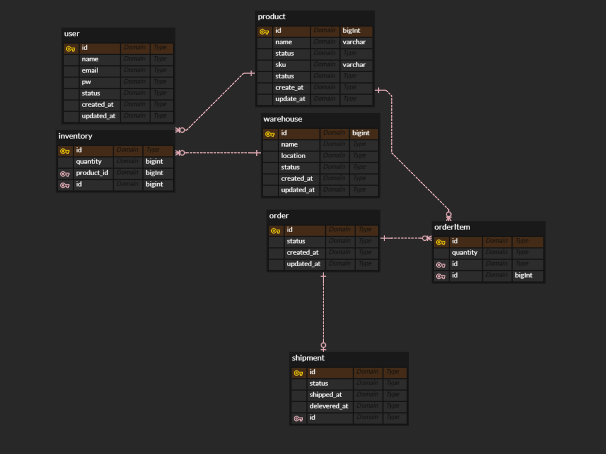

# Logi-D – 물류 관리 예제 프로젝트

Spring Boot 기반 물류 관리 시스템 예제 프로젝트입니다.  
쉬운 버전으로 기억을 되살리기 위해 시작했습니다

---
# 0. 프로젝트 중단
이유 : 쉬운 프로젝트를 목표로 진행하다보니 도메인에 대한 깊이가 얕은 상태로 시작했습니다. 
얕은 수준의 프로젝트는 단순 CRUD 보일러 코드를 반복하는 것 이상의 학습 효과를 기대하기 어렵다고 느꼈습니다. 
그래서 logi-d 프로젝트는 여기까지 진행하고 새로운 프로젝트를 진행합니다 ;)
 
 
 
 
 
 
 
 
 
 
 

---

## 1. 프로젝트 목적

본 프로젝트는 Java 기반 물류 관리 시스템으로,
입·출고, 재고, 주문, 배송 상태를 체계적으로 관리하는 것을 목표로 합니다.

실무에서 자주 사용되는 물류 도메인을 중심으로
도메인 설계, REST API, 트랜잭션 처리, 동시성 제어를 학습·적용하는 것을 주요 목적으로 합니다.

---

## 2. 도메인 개요

### 핵심 흐름

상품 등록
→ 창고 보관
→ 재고 입고
→ 주문 생성
→ 재고 차감
→ 출고 / 배송

## 3. 주요 기능
### 2.1 상품 관리

- 상품 등록 / 수정 / 삭제
- 상품 조회 (단건, 목록)
- 상품 상태 관리 (판매중, 품절 등)

### 2.2 재고 관리
- 창고별 재고 관리
- 입고 / 출고 처리
- 재고 수량 자동 증감
- 재고 부족 예외 처리

2.3 주문 관리
- 주문 생성
- 주문 상세 조회
- 주문 상태 관리
(CREATED → PAID → SHIPPED → DELIVERED → CANCELED)

2.4 배송 관리

- 배송 정보 등록

- 배송 상태 변경

- 주문과 배송 연계

2.5 공통 기능

- REST API 기반 설계

- 예외 처리 및 공통 응답 포맷

- 트랜잭션 처리

- 동시성 이슈 방지(재고 차감)

---

## 3. 기술 스택

### Backend
- Java 17
- Spring Boot 3.x
- Spring Web
- Spring Data JPA
- Hibernate
- Lombok

### Database
- MySQL

### Test
- JUnit 5
- Mockito

## 4. 프로젝트 구조

## 5. ERD 구조
